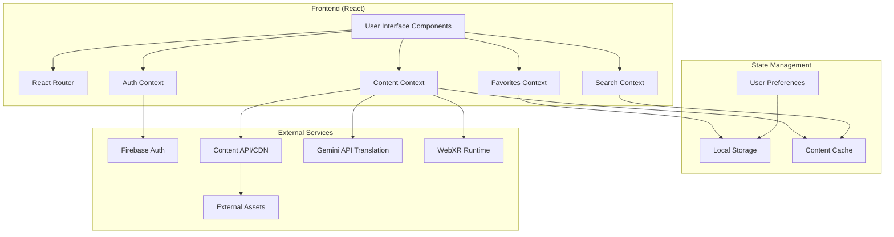
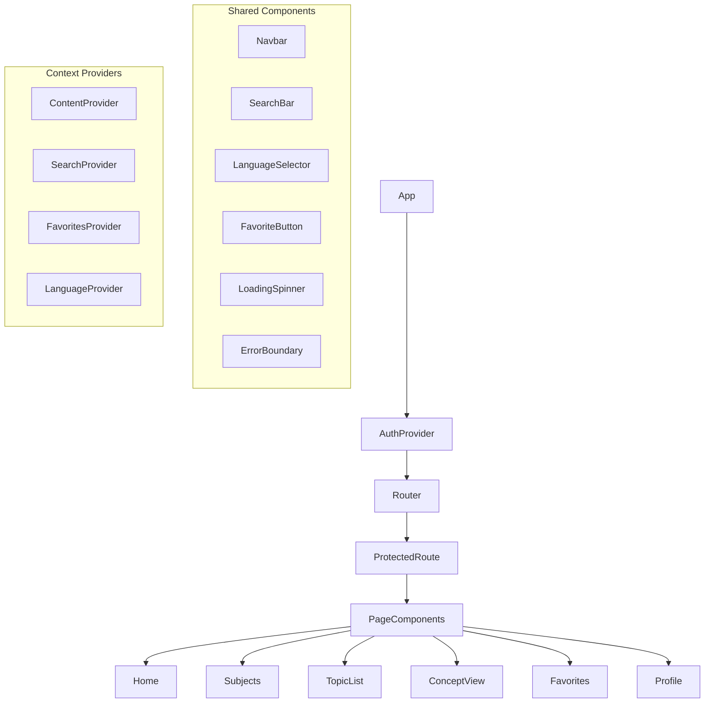
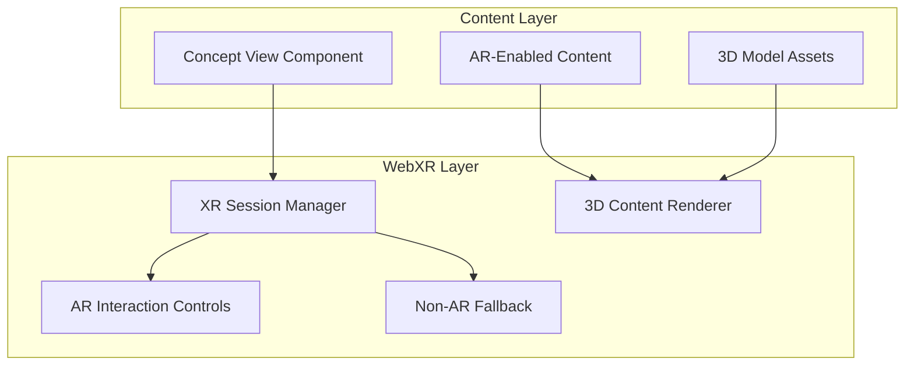

# Design Document: Multilingual STEM Learning Platform

## Overview

The Multilingual STEM Learning Platform extends the existing React web application to provide comprehensive STEM education capabilities. The design builds upon the current Firebase authentication system and React Router navigation, adding content management, search functionality, multilingual support, and user personalization features.

The platform follows a modular architecture where new features integrate seamlessly with existing components while maintaining clear separation of concerns. The design emphasizes performance, offline capability, and accessibility for rural students with varying internet connectivity.

## Architecture

### High-Level Architecture



### Component Architecture

The application follows a hierarchical component structure:



## Components and Interfaces

### Core Context Providers

**ContentContext**

- Manages subject, topic, and concept data
- Handles content caching and offline access
- Provides content loading states and error handling
- Interfaces with external content APIs

**SearchContext**

- Manages search functionality across subjects and concepts
- Provides search history and suggestions
- Handles search result caching
- Supports filtered and scoped searches

**FavoritesContext**

- Manages user's favorite topics and concepts
- Persists favorites to local storage
- Provides favorite status checking and toggling
- Syncs favorites across sessions

**LanguageContext**

- Manages user's language preferences
- Handles content localization using Gemini API for context-aware translation
- Provides fallback language support
- Persists language selection
- Integrates with Gemini API for real-time translation of educational content

### Enhanced Page Components

**Home Page**

- Welcome message with user personalization
- Prominent search interface
- Quick access to recent topics
- Featured content recommendations

**Subjects Page**

- Grid display of four main subjects (Physics, Chemistry, Biology, Engineering)
- Subject-specific topic counts and difficulty indicators
- Direct navigation to topic listings

**Topic List Page**

- Displays topics within a selected subject
- Sorting by name, difficulty, and popularity
- Search and filtering capabilities
- Favorite status indicators

**Concept View Page**

- Displays individual concept content in selected language
- Rich content formatting support
- Favorite toggle functionality
- Navigation to related concepts

**Enhanced Favorites Page**

- Organized display of saved topics and concepts
- Grouping by subject and topic
- Quick access and removal options
- Export and sharing capabilities

**Enhanced Profile Page**

- User information and preferences
- Language selection interface
- Favorites management
- Offline content management

### Utility Components

**SearchBar Component**

- Autocomplete functionality
- Search suggestions based on history
- Scoped search within subjects
- Voice search support (future enhancement)

**LanguageSelector Component**

- Dropdown interface for language selection
- Visual language indicators
- Availability status for content languages

**FavoriteButton Component**

- Toggle favorite status for topics and concepts
- Visual feedback for favorite state
- Optimistic updates with error handling

**ContentLoader Component**

- Handles content loading states
- Offline content indicators
- Error states with retry options
- Progressive loading for large content

## Translation and AR Technology Integration

### Gemini API Translation Strategy

**Context-Aware Translation**:

- Utilizes Gemini API for educational content translation that maintains technical accuracy
- Implements batch translation for concept explanations with educational context preservation
- Provides terminology consistency across related concepts within subjects
- Supports custom prompting for age-appropriate language adaptation

**Translation Architecture**:

```javascript
// Translation service integration
const translateContent = async (content, targetLanguage, context) => {
  const prompt = `Translate this STEM educational content to ${targetLanguage}. 
                  Maintain technical accuracy and educational clarity. 
                  Context: ${context.subject} - ${context.difficulty}
                  Content: ${content}`;
  return await geminiAPI.generateContent(prompt);
};
```

**Implementation Benefits**:

- **Educational Optimization**: Adapts explanations for different educational levels
- **Technical Accuracy**: Maintains scientific terminology precision
- **Cost Efficiency**: Batch processing for content creation, cached results for runtime
- **Contextual Understanding**: Considers subject matter and difficulty level

### WebXR Integration for Phase 2

**WebXR Architecture**:



**AR-Enhanced Content Types**:

- **Molecular Structures**: 3D visualization of chemical compounds and reactions
- **Physics Simulations**: Interactive demonstrations of forces, waves, and energy
- **Biological Systems**: 3D models of cells, organs, and anatomical structures
- **Engineering Concepts**: Mechanical systems, circuit diagrams, and structural models

**Progressive Enhancement Strategy**:

- **Phase 1**: Core learning platform with 2D content and traditional media
- **Phase 2**: WebXR layer addition without disrupting existing functionality
- **Graceful Degradation**: Full functionality on non-AR devices with alternative visualizations

## Data Models

### Subject Model

```typescript
interface Subject {
  id: string;
  name: string;
  description: string;
  icon: string;
  topicCount: number;
  difficulty: "beginner" | "intermediate" | "advanced";
  languages: string[];
}
```

### Topic Model

```typescript
interface Topic {
  id: string;
  subjectId: string;
  name: string;
  description: string;
  difficulty: "beginner" | "intermediate" | "advanced";
  conceptCount: number;
  estimatedTime: number; // in minutes
  prerequisites: string[]; // topic IDs
  languages: string[];
  isFavorite?: boolean;
}
```

### Concept Model

```typescript
interface Concept {
  id: string;
  topicId: string;
  title: string;
  content: ConceptContent;
  difficulty: "beginner" | "intermediate" | "advanced";
  estimatedReadTime: number; // in minutes
  relatedConcepts: string[]; // concept IDs
  languages: string[];
  lastUpdated: Date;
  isFavorite?: boolean;
  // AR/WebXR support
  arEnabled: boolean;
  arAssets?: ARAssets;
  visualizationType?: "3d-model" | "simulation" | "interactive" | "none";
}

interface ConceptContent {
  [language: string]: {
    title: string;
    body: string;
    summary: string;
    examples?: string[];
    images?: string[];
    externalAssets?: string[];
    // Translation metadata
    translatedBy?: "gemini-api" | "human" | "hybrid";
    translationQuality?: number; // 0-1 confidence score
  };
}

interface ARAssets {
  modelUrl?: string;
  textureUrls?: string[];
  animationUrls?: string[];
  interactionConfig?: {
    scalable: boolean;
    rotatable: boolean;
    interactive: boolean;
  };
  fallbackImageUrl: string; // for non-AR devices
}
```

### User Preferences Model

```typescript
interface UserPreferences {
  userId: string;
  preferredLanguage: string;
  fallbackLanguage: string;
  favorites: {
    topics: string[];
    concepts: string[];
  };
  searchHistory: string[];
  lastVisited: {
    subject?: string;
    topic?: string;
    concept?: string;
  };
  offlineContent: string[]; // cached concept IDs
}
```

### Search Result Model

```typescript
interface SearchResult {
  type: "subject" | "topic" | "concept";
  id: string;
  title: string;
  description: string;
  subjectName?: string;
  topicName?: string;
  relevanceScore: number;
  language: string;
}
```

## Correctness Properties

_A property is a characteristic or behavior that should hold true across all valid executions of a system—essentially, a formal statement about what the system should do. Properties serve as the bridge between human-readable specifications and machine-verifiable correctness guarantees._

### Property Reflection

After analyzing all acceptance criteria, several properties can be consolidated to eliminate redundancy:

- Favorite management properties (4.2, 4.3, 4.4) can be combined into comprehensive favorite state management
- Content loading and language properties (3.3, 6.2) can be unified around content retrieval
- Search and filtering properties (2.2, 2.3, 9.2) share similar validation patterns

### Core Properties

**Property 1: Subject-Topic Relationship Integrity**
_For any_ subject selection, all returned topics should belong exclusively to that subject and no topics belonging to that subject should be omitted
**Validates: Requirements 1.2**

**Property 2: Topic Sorting Correctness**
_For any_ list of topics and any sorting criteria (name or difficulty), the resulting list should be correctly ordered according to the specified criteria
**Validates: Requirements 1.3**

**Property 3: Topic-Concept Relationship Integrity**
_For any_ topic selection, all returned concepts should belong exclusively to that topic and no concepts belonging to that topic should be omitted
**Validates: Requirements 1.4**

**Property 4: Search Result Relevance**
_For any_ search query, all returned results should contain the query terms in their title, description, or content
**Validates: Requirements 2.2**

**Property 5: Scoped Search Correctness**
_For any_ subject-scoped search query, all returned results should belong exclusively to the specified subject
**Validates: Requirements 2.3**

**Property 6: Search Result Completeness**
_For any_ search result, the rendered output should include concept title, topic association, and subject category information
**Validates: Requirements 2.4**

**Property 7: Language Content Availability**
_For any_ concept and supported language combination, content should be available in that language or fallback language should be provided
**Validates: Requirements 3.1, 3.3**

**Property 8: Language Preference Persistence**
_For any_ language selection, the preference should persist across browser sessions and be restored on application reload
**Validates: Requirements 3.2**

**Property 9: Language Fallback Behavior**
_For any_ concept where content is unavailable in the selected language, the system should display content in the default language with appropriate notification
**Validates: Requirements 3.4**

**Property 10: Favorite State Management**
_For any_ content item (topic or concept), marking as favorite should immediately update the favorite status, persist across sessions, and be reflected in all relevant UI locations
**Validates: Requirements 4.2, 4.3, 4.4, 4.5**

**Property 11: Profile Favorites Display**
_For any_ user with favorited content, the profile should display all favorited items organized by subject with direct access links
**Validates: Requirements 5.3, 5.4**

**Property 12: Content Loading Resilience**
_For any_ concept with external asset references, the system should successfully load content or provide appropriate error handling with retry options
**Validates: Requirements 6.2, 6.3**

**Property 13: Content Caching Behavior**
_For any_ viewed concept, the content should be cached locally and remain accessible when offline
**Validates: Requirements 7.1, 7.2**

**Property 14: Offline Sync Consistency**
_For any_ user actions performed while offline (favoriting, language changes), these actions should be properly synchronized when connectivity is restored
**Validates: Requirements 7.5**

**Property 15: Navigation State Persistence**
_For any_ navigation between sections, user context and preferences should be maintained without loss of state
**Validates: Requirements 8.2**

**Property 16: Topic Display Information Completeness**
_For any_ topic list display, each topic should show name, difficulty level, and concept count information
**Validates: Requirements 9.1**

**Property 17: Difficulty Filtering Accuracy**
_For any_ difficulty level filter, all returned topics should match the selected difficulty level exactly
**Validates: Requirements 9.2**

## Error Handling

### Content Loading Errors

- **Network Failures**: Graceful degradation to cached content with clear offline indicators
- **Asset Loading Failures**: Retry mechanisms with exponential backoff and user notification
- **Invalid Content References**: Fallback to default content or error messages with support contact

### Search and Navigation Errors

- **Empty Search Results**: Suggested alternative queries and popular content recommendations
- **Invalid Route Navigation**: Automatic redirection to appropriate fallback pages
- **State Corruption**: Automatic state recovery with user notification of data refresh

### User Preference Errors

- **Language Unavailability**: Automatic fallback to supported languages with user notification
- **Favorites Sync Failures**: Local storage preservation with background retry mechanisms
- **Profile Data Corruption**: Reset to defaults with user confirmation and data recovery options

### Offline Functionality Errors

- **Storage Quota Exceeded**: Intelligent cache cleanup with user control over retained content
- **Sync Conflicts**: Conflict resolution with user choice preservation
- **Data Integrity Issues**: Validation and repair mechanisms with user notification

## Testing Strategy

### Dual Testing Approach

The platform will employ both unit testing and property-based testing to ensure comprehensive coverage:

**Unit Tests** focus on:

- Specific component behavior and edge cases
- Integration points between React components and contexts
- Error boundary functionality and recovery mechanisms
- User interface interactions and state transitions

**Property-Based Tests** focus on:

- Universal properties that hold across all valid inputs
- Content relationship integrity across large datasets
- Search and filtering correctness with randomized queries
- State management consistency across various user actions

### Property-Based Testing Configuration

**Testing Framework**: We will use `fast-check` for JavaScript property-based testing, integrated with Jest for the React testing environment.

**Test Configuration**:

- Minimum 100 iterations per property test to ensure thorough input coverage
- Each property test will be tagged with: **Feature: multilingual-stem-learning, Property {number}: {property_text}**
- Custom generators for realistic test data (subjects, topics, concepts, user preferences)
- Shrinking capabilities to identify minimal failing cases

**Test Data Generation**:

- Subject generators with realistic names and metadata
- Topic generators with proper subject associations and difficulty distributions
- Concept generators with multilingual content and asset references
- User preference generators with various language and favorite combinations
- Search query generators with realistic terms and edge cases

### Integration Testing Strategy

**Context Integration Tests**:

- Verify proper data flow between ContentContext and UI components
- Test SearchContext integration with filtering and sorting
- Validate FavoritesContext persistence and synchronization
- Ensure LanguageContext affects content display correctly

**End-to-End User Flows**:

- Complete user journey from subject selection to concept reading
- Search functionality across different scopes and languages
- Favorite management and profile synchronization
- Offline functionality and sync recovery

**Performance Testing**:

- Content loading performance with large datasets
- Search response times with extensive content libraries
- Offline cache efficiency and storage management
- Memory usage patterns during extended application use

### Testing Environment Setup

**Mock Data Strategy**:

- Comprehensive mock content library with multilingual support
- Realistic subject/topic/concept hierarchies for testing
- Simulated network conditions for offline testing
- Mock external asset services for content loading tests

**Test Isolation**:

- Each test suite operates with fresh application state
- Local storage and cache clearing between test runs
- Independent context provider instances for parallel testing
- Proper cleanup of event listeners and async operations

<function_calls>
<invoke name="prework">
<parameter name="featureName">multilingual-stem-learning
